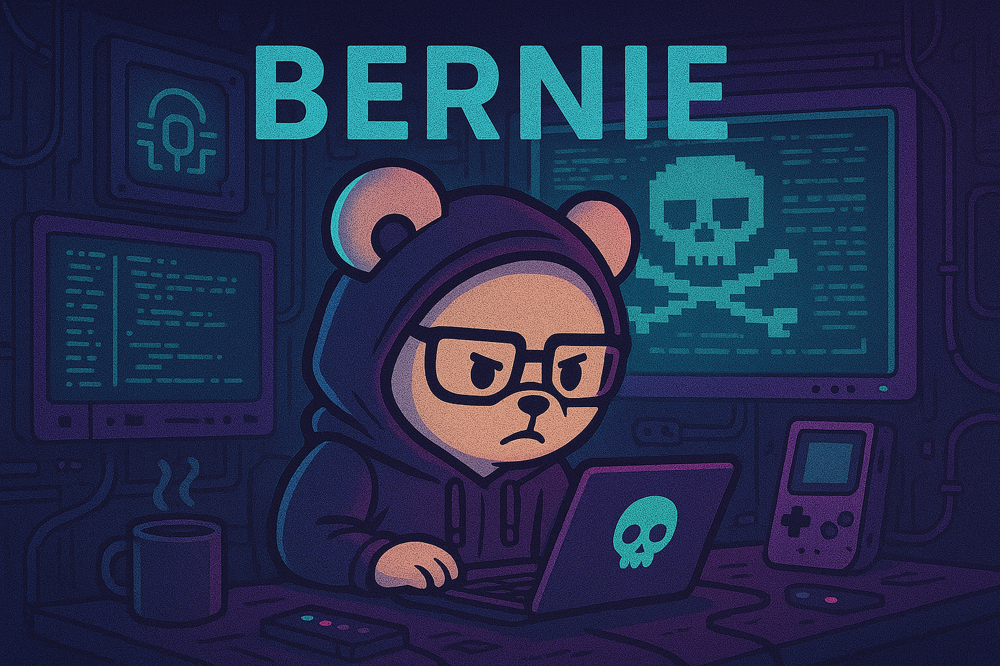

<h1 align="center">Hi, I'm Bernie.</h1>

<p align="center">
  
</p>

<p align="center">
  
</p>

<p align="center">
  
  
  
</p>

---

<table width="100%">
<tr>
<td width="60%" valign="top">

<h3>About</h3>

<p>I'm a .NET / C# engineer professionally, gray hat hacktivist for fun.</p>

<p><b>What I like tinkering with:</b></p>
<ul>
  <li>Deobfuscating game binaries into source code for archival purposes</li>
  <li>Network and application security exploitation</li>
  <li>Game development, emulation, and anything else that catches my interest</li>
</ul>

<p><b>Outside the screens:</b> husband, dad, florida man</p>

<h3>Social &amp; Contact</h3>

<p>
  <a href="https://the-rack.vercel.app/"></a>
  <a href="https://www.linkedin.com/in/bernie-lorente-91008a276/"></a>
  <a href="#"></a>
  <a href="mailto:bs.development.contact@gmail.com"></a>
</p>

</td>
<td width="40%" valign="top" align="center">

<p>
  
</p>

<p>
  
</p>

<!-- Optional: Streak card -->
<!--
<p>
  
</p>
-->

</td>
</tr>
</table>

---

<details>
  <summary><b>Toolbox</b></summary>
  <br/>

  <p>
    
    
    
    
    
    
    
  </p>

  <p>
    
    
    
    
  </p>

  <p>
    
    
    
    
    
    
    
  </p>
</details>

---

<h2>Featured</h2>

<table width="100%">
<tr>
<td align="center">
  <a href="https://github.com/berniemackie97/binary-slicer">
    
  </a>
</td>
<td align="center">
  <a href="https://github.com/berniemackie97/Runewire">
    
  </a>
</td>
</tr>
<tr>
<td align="center">
  <a href="https://github.com/berniemackie97/gba">
    
  </a>
</td>
<td align="center">
  <a href="https://github.com/berniemackie97/Client5517C">
    
  </a>
</td>
</tr>
</table>

---

<h2>Activity</h2>

<p align="center">
  <picture>
    <source media="(prefers-color-scheme: dark)" srcset="https://raw.githubusercontent.com/berniemackie97/berniemackie97/main/snake-output/github-contribution-grid-snake-dark.svg" />
    <source media="(prefers-color-scheme: light)" srcset="https://raw.githubusercontent.com/berniemackie97/berniemackie97/main/snake-output/github-contribution-grid-snake.svg" />
    
  </picture>
</p>

---

<!--START_SECTION:waka-->

```txt
From: 17 December 2025 - To: 26 December 2025

Total Time: 35 hrs 2 mins

Go             13 hrs 11 mins  █████████▒░░░░░░░░░░░░░░░   37.36 %
Astro          5 hrs 21 mins   ███▓░░░░░░░░░░░░░░░░░░░░░   15.16 %
TypeScript     2 hrs 33 mins   █▓░░░░░░░░░░░░░░░░░░░░░░░   07.25 %
CSS            2 hrs 25 mins   █▓░░░░░░░░░░░░░░░░░░░░░░░   06.89 %
MDX            1 hr 17 mins    █░░░░░░░░░░░░░░░░░░░░░░░░   03.67 %
markdown.mdx   1 hr 7 mins     ▓░░░░░░░░░░░░░░░░░░░░░░░░   03.17 %
Rust           1 hr            ▓░░░░░░░░░░░░░░░░░░░░░░░░   02.85 %
Markdown       45 mins         ▓░░░░░░░░░░░░░░░░░░░░░░░░   02.17 %
```

<!--END_SECTION:waka-->

---

<!--## Latest Blog Posts

<!-- BLOG-POST-LIST:START -->
- [Resources to Help You Get Started](https://the-rack.vercel.app/posts/signal-hunt/)
- [Ridge Beacon](https://the-rack.vercel.app/posts/ridge-beacon/)
<!-- BLOG-POST-LIST:END -->

---

<p align="center">
  
</p>

