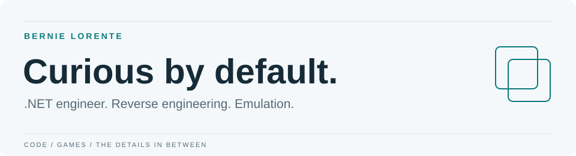
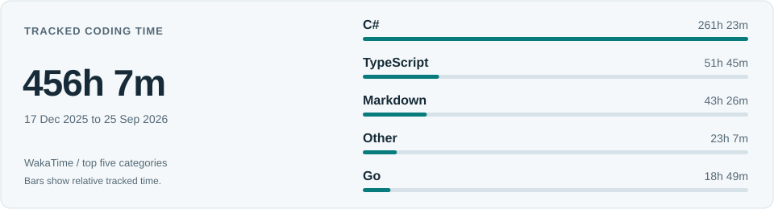
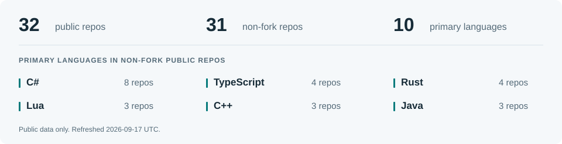

<picture>
  <source media="(max-width: 600px) and (prefers-color-scheme: dark)" srcset="../../assets/header-editorial-dark-mobile.svg" />
  <source media="(max-width: 600px)" srcset="../../assets/header-editorial-light-mobile.svg" />
  <source media="(prefers-color-scheme: dark)" srcset="../../assets/header-editorial-dark.svg" />
  
</picture>

[Blog](https://the-rack.vercel.app/) · [LinkedIn](https://www.linkedin.com/in/bernie-lorente-91008a276/) · [Email](mailto:bs.development.contact@gmail.com)

I write C# and .NET for work. My own projects tend to involve game binaries, emulators, and tools that help me understand how things work under the hood.

Outside of that: husband, dad, Florida man.

## Selected work

### [binary-slicer](https://github.com/berniemackie97/binary-slicer)

**Reverse engineering · Rust**

A toolkit for breaking native game binaries into smaller, documented pieces. Keeps analysis notes, reports, and repeatable workflows together, so the next session doesn't start from scratch.

### [Runewire](https://github.com/berniemackie97/Runewire)

**Security tooling · C# / C++**

A lab for repeatable process injection experiments. Recipes describe the test; the tooling handles orchestration, native execution, and checks before a run.

**More game projects**

- [gba](https://github.com/berniemackie97/gba): a Game Boy Advance emulator in Rust.
- [Client5517C](https://github.com/berniemackie97/Client5517C): C++ launcher and patching tools for Conquer Online 5517.

[Browse all repositories](https://github.com/berniemackie97?tab=repositories)

## At the keyboard

<picture>
  <source media="(max-width: 600px) and (prefers-color-scheme: dark)" srcset="../../assets/coding-editorial-dark-mobile.svg" />
  <source media="(max-width: 600px)" srcset="../../assets/coding-editorial-light-mobile.svg" />
  <source media="(prefers-color-scheme: dark)" srcset="../../assets/coding-editorial-dark.svg" />
  
</picture>

Coding-time details

**374 hrs 30 mins tracked** · 17 Dec 2025 to 03 Sep 2026

| Language | Time |
| :--- | ---: |
| C\# | 192 hrs 10 mins |
| TypeScript | 50 hrs 13 mins |
| Markdown | 34 hrs 8 mins |
| Go | 18 hrs 49 mins |
| Other | 14 hrs 40 mins |

Source: WakaTime. Tracked editor time; the table shows the top five categories.

**Main tools:** C#, .NET, ASP.NET Core, Rust, C++, Go, TypeScript.

The rest of the toolbox

C, Lua, React, Next.js, Unity, Docker, MySQL, Linux, Windows.

## From the blog

- [Resources to Help You Get Started](https://the-rack.vercel.app/posts/signal-hunt/)
- [Ridge Beacon](https://the-rack.vercel.app/posts/ridge-beacon/)

Public GitHub snapshot

<picture>
  <source media="(max-width: 600px) and (prefers-color-scheme: dark)" srcset="../../assets/stats-editorial-dark-mobile.svg" />
  <source media="(max-width: 600px)" srcset="../../assets/stats-editorial-light-mobile.svg" />
  <source media="(prefers-color-scheme: dark)" srcset="../../assets/stats-editorial-dark.svg" />
  
</picture>

Snapshot details

Updated 2026-09-04 UTC. 42 public repositories, 39 excluding forks, and 11 primary languages.

C\#: 10, C\+\+: 6, TypeScript: 5, Rust: 4, Lua: 3, Java: 3, C: 2, Astro: 2, Go: 2, Python: 1, CSS: 1.

Each non-fork public repository with a detected primary language is counted once. These are repository counts, not time spent or proficiency scores.

Contribution snake

<picture>
  <source media="(prefers-color-scheme: dark)" srcset="../../snake-output/github-contribution-grid-snake-dark.svg" />
  
</picture>

