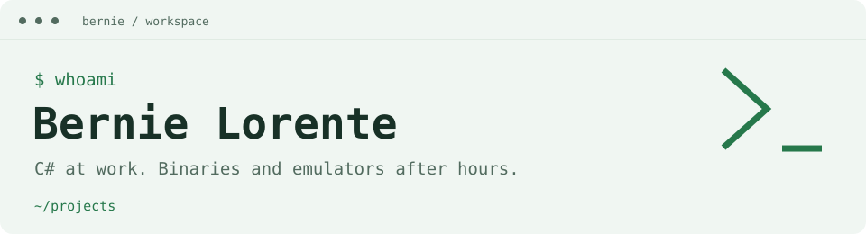
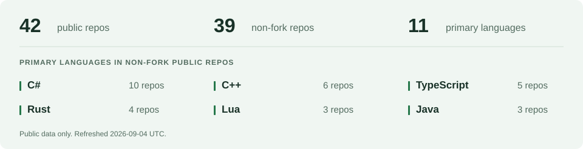

<picture>
  <source media="(max-width: 600px) and (prefers-color-scheme: dark)" srcset="../../assets/header-terminal-dark-mobile.svg" />
  <source media="(max-width: 600px)" srcset="../../assets/header-terminal-light-mobile.svg" />
  <source media="(prefers-color-scheme: dark)" srcset="../../assets/header-terminal-dark.svg" />
  
</picture>

# Hi, I'm Bernie.

**C# at work. Binaries and emulators after hours.**

[Blog](https://the-rack.vercel.app/) · [LinkedIn](https://www.linkedin.com/in/bernie-lorente-91008a276/) · [Email](mailto:bs.development.contact@gmail.com)

I'm a .NET / C# engineer. After work, I usually end up somewhere between a game binary, an emulator, and a tool I wanted badly enough to build myself.

Husband, dad, Florida man. Still making time to build things and figure out how they work.

## /projects

### [binary-slicer](https://github.com/berniemackie97/binary-slicer)

**Rust · Reverse engineering**

A toolkit for breaking native binaries into smaller, documented pieces. Built around repeatable analysis, with Capstone, Rizin, and Ghidra integrations.

### [Runewire](https://github.com/berniemackie97/Runewire)

**C# / C++ · Security tooling**

A recipe-driven lab for repeatable process injection experiments. Managed orchestration, native tooling, and checks before a run.

### [gba](https://github.com/berniemackie97/gba)

**Rust · Emulation**

A Game Boy Advance emulator project. A place to dig into hardware behavior, CPU emulation, and the details that make old games tick.

### [Client5517C](https://github.com/berniemackie97/Client5517C)

**C++ · Game tooling**

Windows client launcher tooling for Conquer Online 5517, including patch startup, configuration parsing, and UI logging.

## /toolbox

**Day job:** C#, .NET, ASP.NET Core

**Projects:** Rust, C, C++, Go, TypeScript, Lua

**Around the edges:** React, Next.js, Unity, Docker, MySQL, Linux, Windows

## /interests

- Reverse engineering and documenting game binaries for preservation.
- Network and application security, especially the parts I can test in a lab.
- Game development, emulation, and whatever sends me down the next rabbit hole.

## /activity

<picture>
  <source media="(max-width: 600px) and (prefers-color-scheme: dark)" srcset="../../assets/stats-terminal-dark-mobile.svg" />
  <source media="(max-width: 600px)" srcset="../../assets/stats-terminal-light-mobile.svg" />
  <source media="(prefers-color-scheme: dark)" srcset="../../assets/stats-terminal-dark.svg" />
  
</picture>

Snapshot details

Updated 2026-09-04 UTC. 42 public repositories, 39 excluding forks, and 10 primary languages.

C\#: 10, C\+\+: 6, TypeScript: 5, Rust: 4, Lua: 3, Java: 3, C: 2, Astro: 2, Go: 2, CSS: 1.

Each non-fork public repository with a detected primary language is counted once. These are repository counts, not time spent or proficiency scores.

Open coding time

**366 hrs 10 mins tracked** · 17 Dec 2025 to 02 Sep 2026

| Language | Time |
| :--- | ---: |
| C\# | 185 hrs 27 mins |
| TypeScript | 50 hrs 13 mins |
| Markdown | 32 hrs 48 mins |
| Go | 18 hrs 49 mins |
| Other | 14 hrs 12 mins |

Source: WakaTime. Tracked editor time; the table shows the top five categories.

A little contribution snake

<picture>
  <source media="(prefers-color-scheme: dark)" srcset="../../snake-output/github-contribution-grid-snake-dark.svg" />
  
</picture>

## /writing

- [Resources to Help You Get Started](https://the-rack.vercel.app/posts/signal-hunt/)
- [Ridge Beacon](https://the-rack.vercel.app/posts/ridge-beacon/)

---

[All repositories](https://github.com/berniemackie97?tab=repositories) · [Get in touch](mailto:bs.development.contact@gmail.com)
